<div align="center">

# Mova

### Personalized Movie Discovery & Streaming Experience

[](https://flutter.dev)
[](https://dart.dev)
[](https://www.themoviedb.org)
[](https://firebase.google.com)


**A bilingual Flutter application for movie discovery, advanced search and filtering, personalized watchlists, trailers, supported media playback, and Firebase-backed user experiences.**

[Features](#key-features) • [My Contribution](#my-contribution) • [Screenshots](#screenshots) • [Architecture](#architecture) • [Tech Stack](#tech-stack)

</div>

> **Portfolio showcase:** The application source code and service credentials are maintained privately. This public repository presents the product and my independent Flutter work.

## Overview

**Mova** brings movie discovery and personal movie management into one mobile experience. Users can browse popular and top-rated titles, search and filter the catalog, explore detailed movie information, view cast and trailers, discover similar titles, and build a personal watchlist.

The application combines TMDB movie data with Firebase-backed user services and persistent local preferences. It supports personalized onboarding, notifications, theme switching, and a complete English/Arabic experience with RTL layouts.

### The Product at a Glance

| User Need | Mova Experience |
| --- | --- |
| Discover movies quickly | Popular, top-rated, upcoming, and similar-title browsing |
| Find a specific title | Dynamic search and filters for genre, year, popularity, and rating |
| Decide what to watch | Movie details, cast, overview, trailers, comments, and recommendations |
| Save personal choices | Firebase-backed profile features and a personal **My List** watchlist |
| Enjoy a localized interface | English/Arabic switching, RTL support, and persistent light/dark themes |

## Key Features

- Firebase Authentication with account creation, sign-in, and password recovery.
- Personalized onboarding with movie-interest selection and profile setup.
- Popular and top-rated movie browsing.
- Search with dynamic movie results.
- Multi-criteria filtering by genre, release year, popularity, and rating.
- Detailed movie pages with metadata, overview, genres, cast, trailers, similar titles, and comments.
- Personal **My List** watchlist management.
- Supported movie playback and watch-history functionality.
- YouTube trailer integration through external URL handling.
- Upcoming movie content and notification support.
- English and Arabic localization with full RTL layouts.
- Light and dark theme support with persisted preferences.

## My Contribution

Mova is an **independent Flutter project**, and I implemented the mobile application across its core development areas.

My work included:

- Building the Flutter UI across authentication, onboarding, discovery, movie details, watchlist, and profile flows.
- Managing application state with **Provider**.
- Integrating the **TMDB API** for movie discovery, search, filtering, genres, cast information, trailers, and similar content.
- Integrating **Firebase Authentication**, **Cloud Firestore**, **Firebase Storage**, and **Firebase Cloud Messaging**.
- Implementing navigation, reusable widgets, asynchronous loading states, and dynamic media content.
- Building English/Arabic localization with RTL support.
- Implementing light/dark theming with persisted preferences.
- Implementing movie playback, watch history, watchlist behavior, and notification flows.

## Tech Stack

**Mobile**
- Flutter
- Dart

**State Management**
- Provider

**Backend & Data**
- TMDB REST API
- HTTP

**Firebase**
- Firebase Authentication
- Cloud Firestore
- Firebase Storage
- Firebase Cloud Messaging

**Persistence & Device Features**
- SharedPreferences
- SQLite (`sqflite`)
- Flutter Local Notifications

**Media & Localization**
- Better Player
- URL Launcher
- Easy Localization
- English / Arabic RTL support

## Architecture

Mova uses a practical **Provider-based Flutter structure** that separates feature state from presentation code without claiming a formal Clean Architecture or MVVM implementation.

Providers expose state to the UI and notify listening widgets when data changes. Feature-specific providers manage movie data, profile state, casting, trailers, upcoming content, watchlist behavior, language, and theme preferences.

The project is organized around presentation screens, models, providers, services, reusable widgets, and external integrations such as TMDB and Firebase.

## Project Structure

```text
lib/
├── Media/
├── Presentations/
│   ├── Movies/
│   └── Screens/
│       ├── Authentication/
│       ├── BottomNavigation/
│       ├── MovieTabs/
│       ├── Onboarding/
│       └── Profile/
├── Providers/
├── Services/
├── Utilities/
│   ├── Models/
│   └── Widget/
├── firebase_options.dart
└── main.dart
```

## Screenshots

### Welcome & Personalization

<p align="center">
  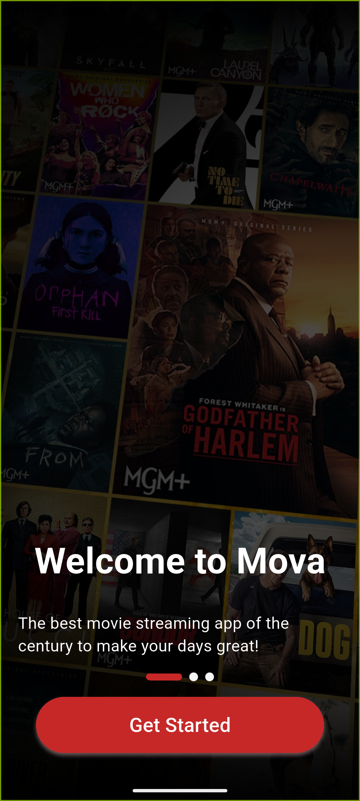
  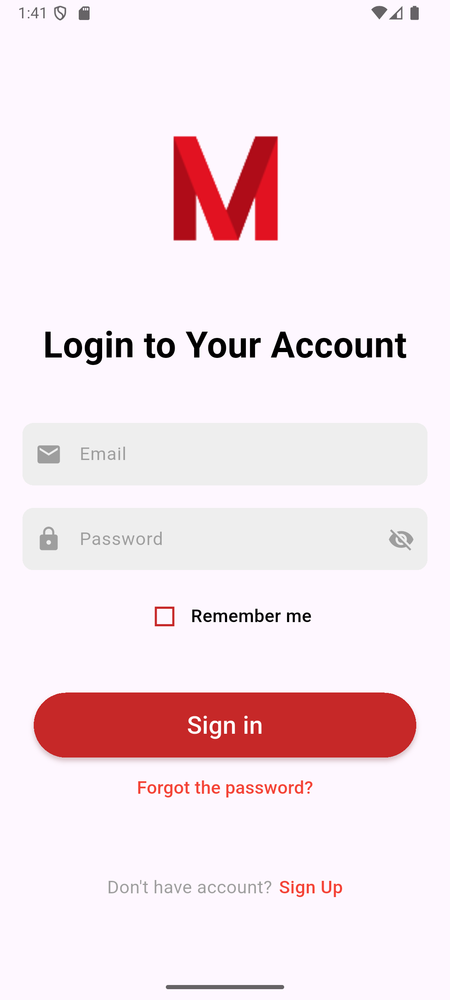
  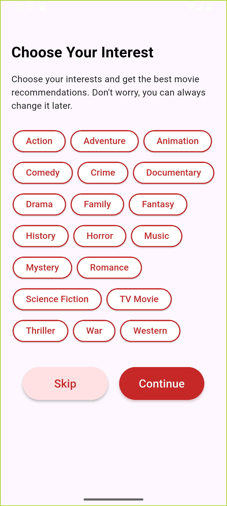
</p>

### Discovery & Search

<p align="center">
  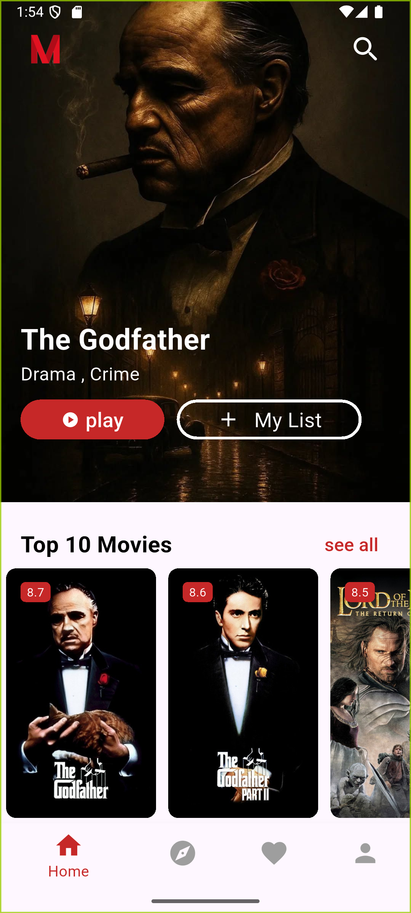
  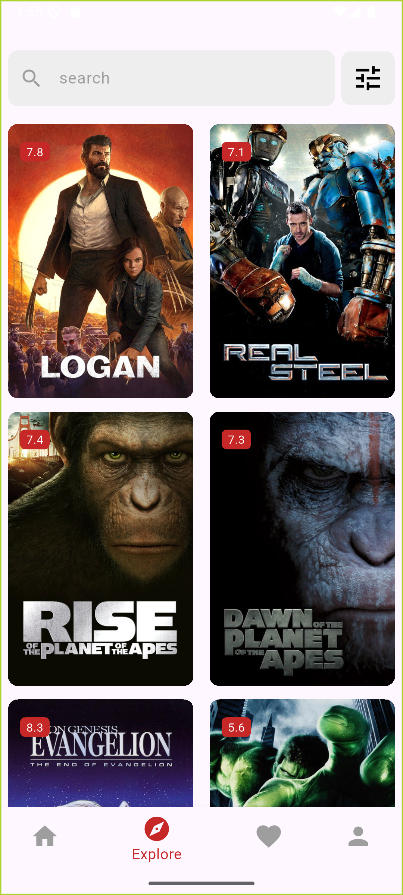
  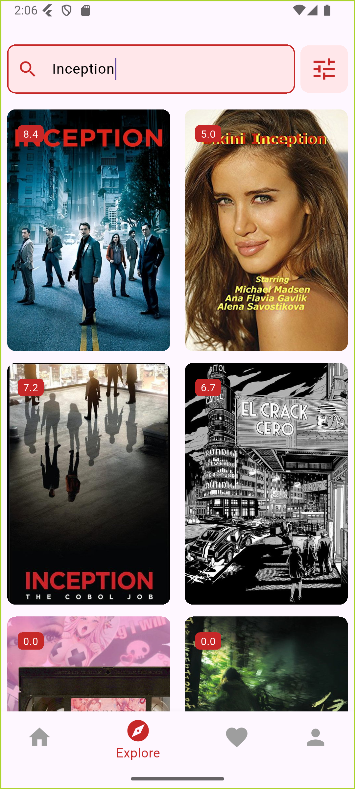
</p>

### Filters, Details & Trailers

<p align="center">
  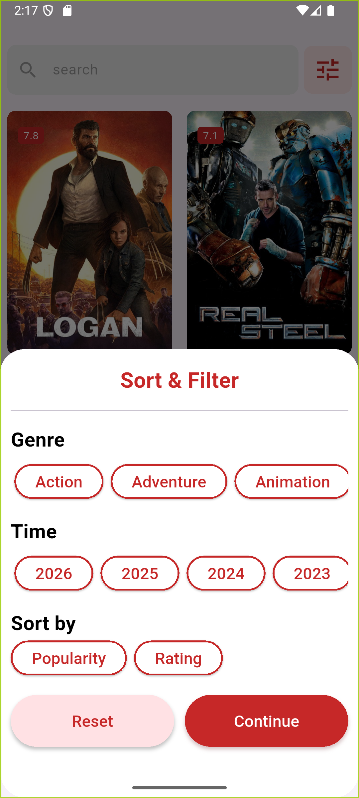
  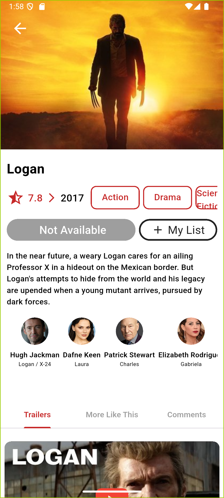
  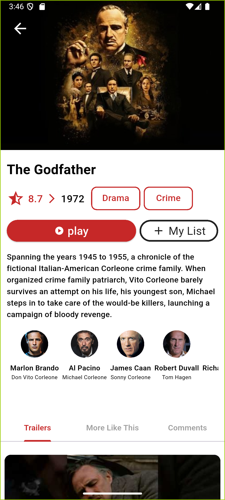
</p>

### Personalization, Theme & RTL

<p align="center">
  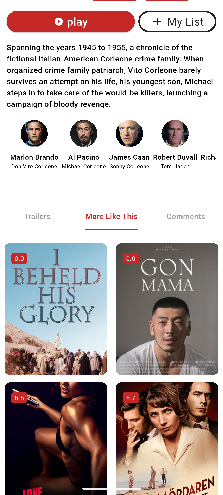
  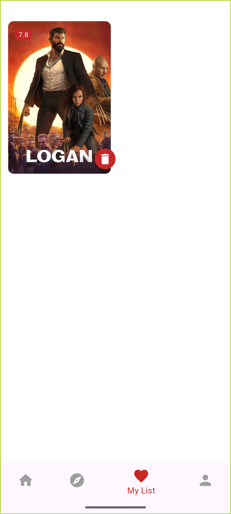
  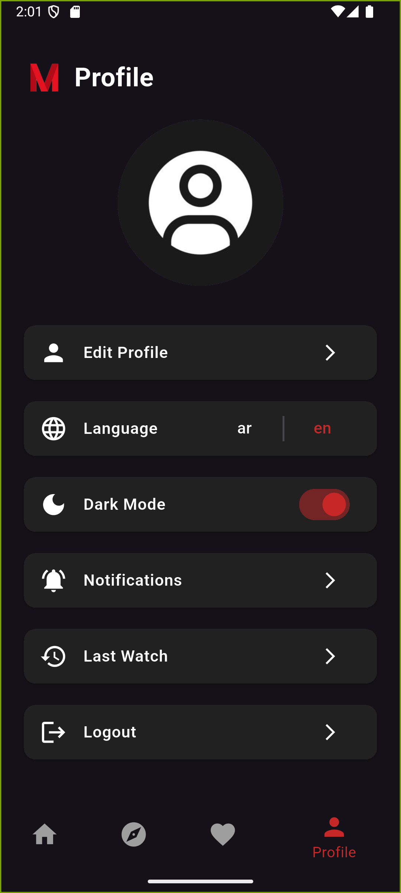
</p>

<p align="center">
  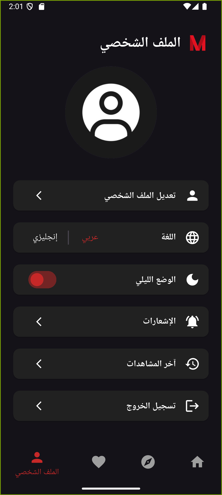
</p>

## Project Highlights

- Provider-based state management across multiple application features.
- REST API integration for search, discovery, filtering, cast data, trailers, and recommendations.
- Firebase-backed authentication, user data, storage, and notifications.
- Persistent theme, language, and filter preferences.
- Media playback and external trailer handling.
- English/Arabic localization with RTL support.
- Reusable Flutter UI components and feature-oriented organization.

## Future Improvements

- Move all API credentials into environment-based configuration.
- Add unit, widget, and integration tests for critical flows.
- Introduce a dedicated repository/data layer for stronger separation of concerns.
- Improve offline caching for movie metadata and images.
- Add CI workflows for automated analysis, testing, and Android builds.
- Expand accessibility and responsive-layout coverage across more device sizes.

## Notes

This public repository is intended as a **portfolio showcase** and does not expose private source code or secrets. Movie metadata is powered by TMDB, while user-facing application services integrate Firebase. This product uses the TMDB API but is not endorsed or certified by TMDB.

## Author

**Mariam Abu Sawwa**  
Flutter Developer

GitHub: [@mariamsawwa12](https://github.com/mariamsawwa12)
